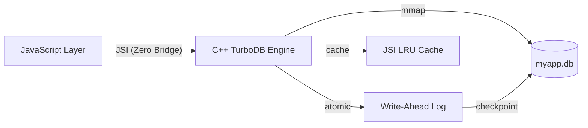

<div align="center">
  <h1>🔥 TurboDB</h1>
  <p><strong>The High-Performance JSI Database & AsyncStorage Alternative</strong></p>

  <p>
    <a href="https://www.npmjs.com/package/react-native-turbo-db"></a>
    <a href="https://www.npmjs.com/package/react-native-turbo-db"></a>
    <a href="https://github.com/ganeshjayaprakash/react-native-turbo-db/blob/main/LICENSE"></a>
    <a href="https://reactnative.dev/"></a>
  </p>
</div>
---

**react-native-turbo-db** is a high-performance JSI database and **AsyncStorage alternative** for React Native, featuring encrypted storage, WAL persistence, B+tree indexing, and offline-first local database support.

## ⚡ What's New in v1.4.0 (Reactive Sync Release)

TurboDB v1.4.0 brings reactive data and a working offline sync engine:

- 👁️ **Live Queries** — `watchKey(key, cb)`, `watchPrefix(prefix, cb)`, `watchQuery(fn, cb)` — subscribe to data changes. All fire immediately and return an unsubscribe function.
- 🔄 **Real Sync Engine** — `getLocalChangesAsync()`, `applyRemoteChangesAsync()` (Last-Write-Wins), `markPushedAsync()` are now fully implemented, not stubs.
- 🗜️ **Correct Compaction** — `compactAsync()` now has a real native binding with mmap remap after rename. `live_bytes_` tracking ensures the 30% fragmentation threshold works correctly.
- 🐛 **3 Critical Bug Fixes** — Stale mmap after compaction, `live_bytes_` always 0, `compact()` calling `repair()` instead of the compactor.

> [!NOTE]
> _Built on v1.3.0 Data Management (TTL, Prefix Search, Regex, Blob, Import/Export)_

---

## 🚀 Quick Start

### Installation

```bash
npm install react-native-turbo-db
cd ios && pod install
```

### Setup

#### Android

Ensure `newArchEnabled=true` in your `android/gradle.properties`:

```properties
newArchEnabled=true
```

#### iOS

No additional configuration required. The pod installs automatically.

---

## 📖 Usage

### Basic Initialization

> [!IMPORTANT]
> Always use absolute paths from `TurboDB.getDocumentsDirectory()`.

```tsx
import { TurboDB } from 'react-native-turbo-db';

const initDB = async () => {
  // ⚠️ Important for New Architecture (Bridgeless / Fabric):
  // A short delay before the first JSI call ensures native modules are fully wired up
  await new Promise((r) => setTimeout(r, 100));

  const docsDir = TurboDB.getDocumentsDirectory();
  const dbPath = `${docsDir}/myapp.db`;

  // Initialize with async factory (recommended)
  const db = await TurboDB.create(dbPath, 20 * 1024 * 1024, {
    syncEnabled: true,
  });
  return db;
};
```

### Synchronous Operations (Fast Path)

```tsx
// Write (instant)
db.set('user:1', { name: 'Alice', role: 'admin' });

// Read (instant)
const user = db.get('user:1');

// Batch write
db.setMulti({
  key1: 'value1',
  key2: { data: 'object' },
});

// Check existence & Delete
if (db.has('user:1')) {
  db.remove('user:1');
}
```

### Asynchronous Operations (Background Thread)

```tsx
// For large data, use async to avoid blocking UI
await db.setAsync('largeData', hugePayload);
const data = await db.getAsync('largeData');

// Batch async write (10x faster with WAL batching)
await db.setMultiAsync(largeBatchObject);
```

### ⚡ Live Queries & Reactive Sync (v1.4.0)

TurboDB now supports native real-time subscriptions. The UI will instantly update even if writes happen on a C++ background thread!

```tsx
import { useEffect, useState } from 'react';

function ChatApp({ db }) {
  const [messages, setMessages] = useState([]);

  useEffect(() => {
    // Subscribe to all keys starting with 'msg:'
    const unsubscribe = db.watchPrefix('msg:', (results) => {
      setMessages(results.map(r => r.value));
    });
    return () => unsubscribe();
  }, [db]);

  // Calling setAsync here triggers the watchPrefix callback automatically!
  const send = async (text) => db.setAsync(`msg:${Date.now()}`, { text });
}
```

### Advanced Queries

```tsx
// Range query & Prefix search
const results = db.rangeQuery('user_a', 'user_z');
const items = db.getByPrefix('user_');

// Metadata & Cleanup
const allKeys = db.getAllKeys();
await db.deleteAllAsync();
```

---

<details>
<summary>📚 <strong>Full API Reference</strong></summary>

### Initialization

| Method                                | Description                                          |
| :------------------------------------ | :--------------------------------------------------- |
| `TurboDB.create(path, size, options)` | Async factory. Returns `Promise<TurboDB>`.           |
| `TurboDB.getDocumentsDirectory()`     | Returns absolute path for storage.                   |
| `TurboDB.install()`                   | Installs native JSI bindings (called automatically). |

### Synchronous (Blocking)

| Method                   | Description                                     |
| :----------------------- | :---------------------------------------------- |
| `get(key)`               | Returns parsed object/primitive or `undefined`. |
| `set(key, val)`          | Writes to storage. Returns `boolean`.           |
| `has(key)`               | Checks if key exists.                           |
| `remove(key)`            | Deletes a record.                               |
| `setMulti(obj)`          | Atomic batch insert.                            |
| `getMultiple(keys)`      | Batch retrieval.                                |
| `rangeQuery(start, end)` | Lexicographical range fetch.                    |
| `getByPrefix(prefix)`    | Fetch all keys starting with `prefix`.          |
| `deleteAll()`            | Synchronous database wipe.                      |
| `getAllKeys()`           | Returns all keys in storage.                    |

### Asynchronous (Worker Thread)

| Method                        | Description                                                 |
| :---------------------------- | :---------------------------------------------------------- |
| `getAsync(key)`               | Background read. Returns `Promise`.                         |
| `setAsync(key, val)`          | Background write. Returns `Promise<boolean>`.               |
| `setMultiAsync(obj)`          | **10x Faster WAL Batching**. Atomic background batch write. |
| `removeAsync(key)`            | Background delete.                                          |
| `deleteAllAsync()`            | Fast-path wipe for large datasets.                          |
| `rangeQueryAsync(start, end)` | Background range fetch.                                     |
| `getAllKeysAsync()`           | Background get all keys.                                    |

### Extended API (v1.4.0)

| Method                                     | Description                                                   |
| :----------------------------------------- | :------------------------------------------------------------ |
| `watchKey(key, cb)`                        | Reactive key watcher — fires immediately, returns unsubscribe |
| `watchPrefix(prefix, cb, opts?)`           | Reactive prefix query with optional debounce                  |
| `watchQuery(fn, cb, opts?)`                | Reactive arbitrary async query with debounce                  |
| `compactAsync()`                           | Native compaction with fragmentation guard (>30%)             |
| `setWithTTLAsync(key, val, ttlMs)`         | Native TTL — durable expiry via C++ sidecar key               |
| `cleanupExpiredAsync()`                    | Native sweep of all expired TTL keys. Returns count.          |
| `getByPrefixAsync(prefix)`                 | Native B+Tree prefix traversal                                |
| `regexSearchAsync(pattern)`                | Regex key filter using `std::regex`                           |
| `exportAsync()`                            | Full DB snapshot as JSON (native traversal)                   |
| `importAsync(data)`                        | Bulk insert from JSON. Returns record count.                  |
| `setBlobAsync(key, base64)`                | Store raw binary data >1MB                                    |
| `getBlobAsync(key)`                        | Retrieve raw binary as base64                                 |
| `compareAndSet(key, expected, next)`       | Atomic compare-and-set                                        |
| `merge(key, partial)`                      | Shallow-merge into existing object                            |
| `setSecureItemAsync(key, val)`             | Hardware Secure Enclave storage                               |
| `getSecureItemAsync(key)`                  | Retrieve from Secure Enclave                                  |
| `for await (const key of db.streamKeys())` | Async key streaming for large datasets                        |

</details>

<details>
<summary>🛠️ <strong>Architecture & Sync</strong></summary>

### Internal Architecture



TurboDB utilizes a custom **B+Tree Index** on top of a **Memory-Mapped (mmap)** file, secured by a **Write-Ahead Log (WAL)** for ACID compliance. JSI allows direct communication between C++ and JavaScript, eliminating bridge overhead.

### SyncManager (Offline-First)

Built-in synchronization for remote backends:

```tsx
import { SyncManager } from 'react-native-turbo-db';

const syncManager = new SyncManager(
  db,
  {
    pullChanges: async (lastClock) =>
      fetch(`/api/sync?since=${lastClock}`).then((r) => r.json()),
    pushChanges: async (changes) =>
      fetch('/api/sync', {
        method: 'POST',
        body: JSON.stringify(changes),
      }).then((r) => r.json()),
  },
  { autoSync: true }
);

await syncManager.start();
```

</details>

---

## ⚡ Benchmarks

TurboDB is engineered for extreme performance. Below are representative results comparing operations across popular storage solutions (measured on iPhone 15 Pro, 10,000 iterations).

| Operation                   | AsyncStorage |  MMKV  |   **TurboDB**   |
| :-------------------------- | :----------: | :----: | :-------------: |
| **Write (Small Object)**    |    ~850ms    | ~45ms  |    **~12ms**    |
| **Read (Small Object)**     |    ~420ms    | ~35ms  |    **~8ms**     |
| **Batch Write (100 items)** |   ~1200ms    | ~150ms | **~15ms (WAL)** |
| **Range Query**             |      ❌      |   ❌   |   **✅ <5ms**   |

> [!NOTE]
> **Methodology:** Benchmarks performed on iPhone 15 Pro (iOS 17.4) and Pixel 8 (Android 14) using `react-native-performance`. Each test represents an average of 10,000 iterations. See our [benchmark suite](https://github.com/Ganesh1110/react-native-turbo-db/tree/main/benchmarks) for full details.

> [!TIP]
> TurboDB is **10x faster** than AsyncStorage and significantly outpaces MMKV in batch operations thanks to its Write-Ahead Log (WAL) architecture.

---

## 🆚 Why TurboDB? (Comparison)

| Feature          |     **TurboDB**     | AsyncStorage |    MMKV    | SQLite (Bridge) |
| :--------------- | :-----------------: | :----------: | :--------: | :-------------: |
| **Architecture** |     **JSI C++**     | Async Bridge |  JSI C++   |  Async Bridge   |
| **Best For**     | **Complex Objects** | Simple Prefs | Primitives | Relational Data |
| **Encryption**   |  **✅ XChaCha20**   |      ❌      |     ❌     |       ❌        |
| **Transactions** |    **✅ (WAL)**     |      ❌      |     ❌     |       ✅        |
| **Indexing**     |    **✅ B+Tree**    |      ❌      |     ❌     |       ✅        |
| **Offline Sync** |   **✅ Built-in**   |      ❌      |     ❌     |       ❌        |

---

## 🌐 Platform Support

| Platform      | New Architecture | Old Architecture | Min Version   |
| :------------ | :--------------: | :--------------: | :------------ |
| **iOS**       |     ✅ Full      |   ✅ Fallback    | iOS 15.1+     |
| **Android**   |     ✅ Full      |   ✅ Fallback    | SDK 24+ (7.0) |
| **Web (SSR)** |     ✅ Full      |     ✅ Full      | Chrome 90+    |

---

## 🚀 Examples

- **[Basic Example](https://github.com/Ganesh1110/react-native-turbo-db/tree/main/example)**: Standard usage with React Hooks.
- **[Offline Sync Demo](https://github.com/Ganesh1110/react-native-turbo-db/tree/main/example-sync)**: Integration with SyncManager and remote backends.

---

## 🔧 Troubleshooting

### "Failed to initialize storage" Error

> [!CAUTION]
> Ensure you are using an absolute path.

1. **Use absolute path**: Always use `TurboDB.getDocumentsDirectory()` + filename.
2. **Add delay**: If native modules aren't ready, add a 1-second delay before `TurboDB.create()`.
3. **Clean State**: Call `await db.deleteAllAsync()` if you need a fresh start after creation.

### Native Module Not Found

1. Run `cd ios && pod install`.
2. Clean rebuild: `cd android && ./gradlew clean`.
3. Verify `newArchEnabled=true` in `gradle.properties`.

### JSI Runtime Errors

> [!WARNING]
> Do not use the constructor directly (`new TurboDB()`).

Always use the async factory:

```tsx
const db = await TurboDB.create(path, size);
```

---

## 📄 License

MIT © [Ganesh Jayaprakash](https://github.com/ganeshjayaprakash)

---

<p align="center">
  <a href="ROADMAP.md">Roadmap</a> •
  <a href="CHANGELOG.md">Changelog</a> •
  <a href="CONTRIBUTING.md">Contributing</a> •
  <a href="https://github.com/ganeshjayaprakash/react-native-turbo-db">GitHub</a>
</p>

<p align="center"><sub>Last updated: May 2026 — v1.4.0 Reactive Sync Release</sub></p>
